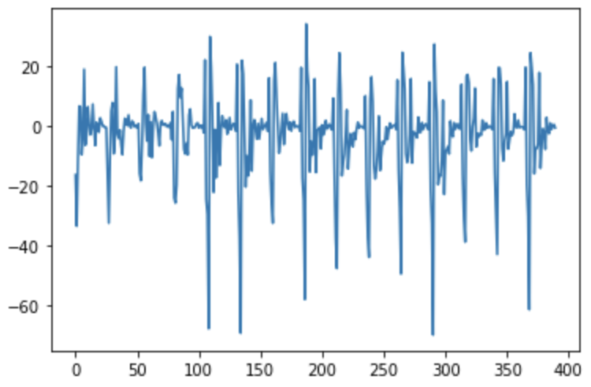

Keyword Spotting on Loihi
=========================

For this project, we will follow the example code from the [NengoLoihi SDK]. Our first goal will be running it on your computer (or one of the lab workstations). If you get stuck, just ask for help!

Installation
------------

Create a new conda environment and activate it. Then use pip to install Nengo packages.
We will need to install the following Python packages with pip:
- nengo
- nengo-dl
- nengo-loihi
- librosa

Make sure that Numpy and Jupyter is also installed in the conda environment.

Getting Started
---------------

Go to [NengoLoihi SDK] and copy the inference code from there. Paste it into a Jupyter notebook and see if it works.
Do spend some time to understand what the code is doing. For example:
- What does the spiking neural network architecture looks like?
- How many neurons does the output layer have and why?

Load your own audio
-------------------

This is where the fun begins. The code that was used to load audio files and train the network can be found in the git repo at [training]. 

- record your own audio files with the keyword, and also others
- convert the files to .wav files with 16000 Hz sampling rate (e.g. with ffmpeg).
- Modify the code to load your own .wav file with librosa (see `training_utils.py` in [training])
- Use the `mfcc` code from `features.py` to take the [Mel-frequency_cepstrum] of your audio (use `n_cepstra = 26`) to get frames of length-26 feature vectors.
- The output from `mfcc` needs to be taken in slices of 15 frames, which are then flattened. For details, see `training_models.py`.
- For reference, compare what your output looks like with what the data looks like in `test_stream`. Plot the `char_out` data taken from the output layer to see how the network responds.

Check out the training code
--------------------------

The [training] code is in a separate github repo. It is done with Tensorflow. Doing more training is quite involving, mainly because you need more training samples.
- Check out the code and try to understand
- Can you train your own audio files?

Running it on the Hardware
--------------------------

If everything works, let's try to run it on the actual neuromorphic hardware!
Please contact for instructions on how to connect and run.

[NengoLoihi SDK]: https://www.nengo.ai/nengo-loihi/examples/keyword-spotting.html
[training]: https://github.com/abr/power_benchmarks/tree/master/training
[Mel-frequency_cepstrum]: https://en.wikipedia.org/wiki/Mel-frequency_cepstrum